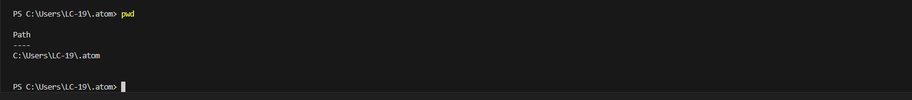
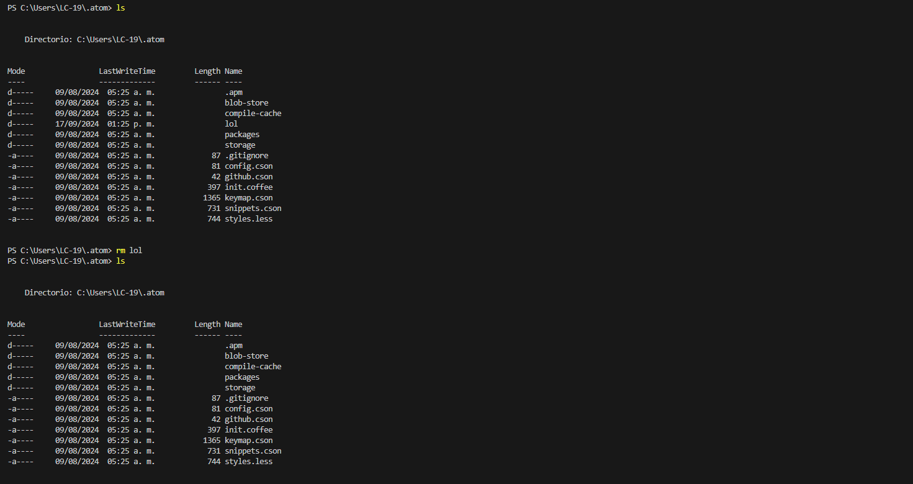
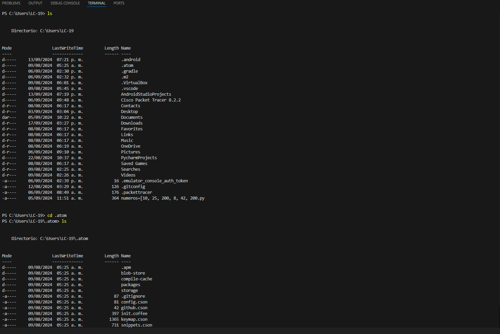
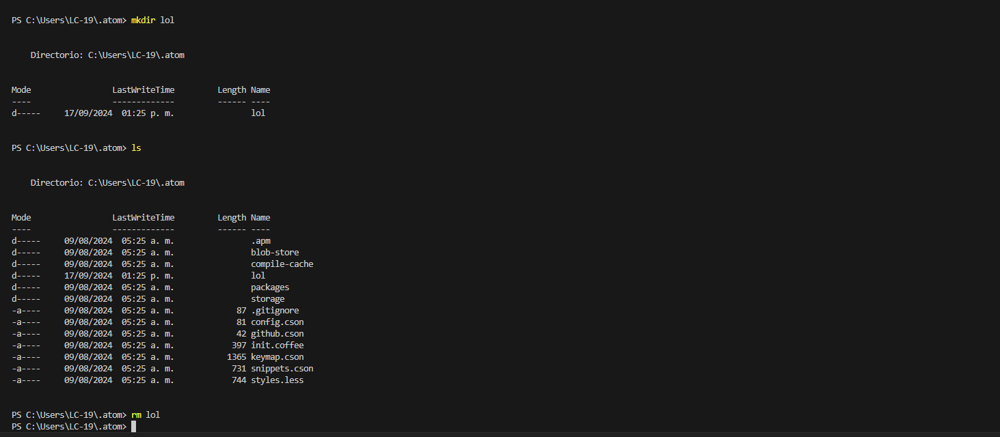

# Práctica de Comandos en la Terminal

## Comando `pwd`
El comando `pwd` se utiliza para mostrar la ruta completa del directorio en el que te encuentras trabajando. Es útil para saber en qué ubicación estás dentro del sistema de archivos.

## Comando `ls`
El comando `ls` se usa para listar los archivos y carpetas que están dentro del directorio actual. Es una forma rápida de ver qué hay en una carpeta.

## Comando `rm`
El comando `rm` permite eliminar archivos o directorios. Si se utiliza con la opción `-r`, puede eliminar directorios y todo su contenido de manera recursiva.

## Comando `cd`
El comando `cd` sirve para moverse entre directorios. Con él puedes cambiar de una carpeta a otra dentro del sistema de archivos.

## Comando `mkdir`
El comando `mkdir` se usa para crear un nuevo directorio o carpeta en la ubicación actual.

